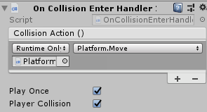

# Action-Handler

Couple single scripts to handle what should happen after certain actions.

## Collision setUp

Add OnCollisionEnterHandler to object with collider. Simple add action like in default unityButton.

1. Play Once will remove Action from gameobject after first action.
1. PlayerCollision will play only after collisions with objects with tag "Player".
